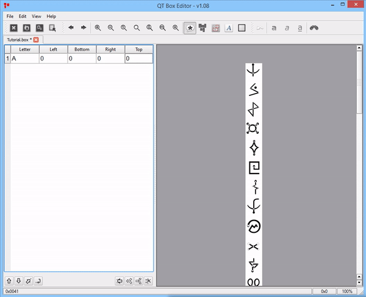

# Fontastic
Train OCR on custom fonts. An old tutorial I made for a friend who needed to train OCR on some rather unique writing.
Sample Alphabet used is the Alienese from Futurama.

Project: Fontastic
==================

  

* * *

What?
-----

A tree-part tutorial that will teach you how to do the following :

*   Create a custom font
*   Prepare and train a model of your font to be used with Tesseract
*   Create a small OCR program in C# using Tesseract to test your training data

* * *

Software requierments
---------------------

The software options mentioned in this tutorial are either free or open source. Nevertheless, if you have access to better alternatives, don’t be afraid to use them.

##### Custom font

*   [Inkscape](https://inkscape.org/release/inkscape-0.92.3/) - for tracing and exporting .svg
*   [paint.NET](https://www.getpaint.net/download.html) - image processing
*   [GIMP](https://www.gimp.org/) - image processing
*   [FontForge](https://fontforge.github.io/en-US/) - creating the font

##### Model training

*   [Tesseract](https://github.com/UB-Mannheim/tesseract/wiki) - binaries present on The Mannheim University Library’s github page.
*   [Qt Box Editor](https://zdenop.github.io/qt-box-editor/) - for box editing and creation
*   [Serak Tesseract Trainer](https://code.google.com/archive/p/serak-tesseract-trainer/) - for creating the training data
*   [Sample training data](https://github.com/tesseract-ocr/tessdata) - sample data for various languages (the file is pretty big)

##### OCR in C#

*   [Visual Studio Community](https://visualstudio.microsoft.com/) - creating the OCR app

* * *

##### Hardware requirements - optional

*   marker and paper
*   scanner or phone
*   graphic tablet (would make things quicker)

* * *

Downloading and setting up the software
---------------------------------------

*   [Inkscape](https://inkscape.org/release/inkscape-0.92.3/) - just as any other piece of software
*   [paint.NET](https://www.getpaint.net/download.html) - just as any other piece of software
*   [GIMP](https://www.gimp.org/) - just as any other piece of software
*   [FontForge](https://fontforge.github.io/en-US/) - just as any other piece of software

* * *

### Tesseract

*   use the [installer](https://github.com/UB-Mannheim/tesseract/wiki) like you would do with any other piece of software
*   by default it will install it in C:\\Program Files (x86)\\Tesseract-OCR
*   you can, of course, change the path but that is up to you

* * *

### Qt Box Editor

*   unzip the [file](https://zdenop.github.io/qt-box-editor) and place its contents into a folder
*   launch Qt - <if it works> → yes → you are good to go  
    ↓ no  
    You have to set up the path to your Tesseract installation → Ctrl+T → Tesseract → TESSDATA\_PREFIX  
    ↓  
    

* * *

### Serak Tesseract Trainer

*   unzip the [file](https://code.google.com/archive/p/serak-tesseract-trainer/) and place its contents into a folder
*   launch Serak - <if it works> → yes → you are good to go  
    ↓ no  
    You have to set up the path to your Tesseract installation → Options → Tesseract Options → Tesseract Path  
    

* * *

Creating your font
------------------

##### Finding the amount of symbols/glyphs you will need

We can easily find this by using FontForge:  
Open FontForge → New → You will something like this ↓  
(I went ahead and color-coded the important parts.)  

Since we are using the English Alphabet as a starting point for this font, we have :

*   26 - glyphs for Uppercase Letters (yellow)
*   26 - glyphs for Lowercase Letters (orange)
*   10 - glyphs for numbers (green)
*   10 - glyphs for basic punctuation marks (blue)
*   22 - glyphs for extended punctuation marks (dark orange)

The software will give you an error if you do not have all the glyphs filled in but the font will still work. ( You can have a font only with numbers, only with Uppercase letters etc.)

* * *

##### Creating your glyphs

*   Creating your own custom glyphs  
    – marker and paper + scanner/photo  
    – graphic tablet
*   Using an already finished alphabet/symbols

Regardless of the method you are using, the most important part is to be sure that you have all the glyphs that you need in order to make your font.  
For the purpose of this Tutorial we will be using an already existing Alphabet: [Alienese](https://futurama.fandom.com/wiki/Alienese) from [Futurama](https://en.wikipedia.org/wiki/Futurama) ↓

* * *

#### The grunt work

##### Segmenting the image

We now have to segment the image have an image for each letter. But before doing that there are some steps that you might want to follow:

*   if the image is not black and white, you should desaturate it  
    – use the desaturate option in your image processing software  
    – in paint. NET → Adjustments → Black and White or Ctrl+Shift+G
*   if the image has no background, you should add one  
    – in paint. NET → use the magic wand to select the parts you want to fill
*   open the image in an image processor of your choice and proceed with creating an image for each letter  
    – in paint. NET → Press S → Select the Letter → Ctrl+C → Ctrl+N → Enter → Ctrl+V → Ctrl+Shift+S → Give it a name → Enter  
    Repeat until you have all the glyphs you need ↓  
    

* * *

##### Importing the images

Now that we have all the images that we need, we can start importing them into FontForge:  
– Open FontForge → New → Ctrl+S → choose a name → Enter  
Now we can start importing the corresponding images for each letter:  
– Double-click the square beneath letter A ↓  
  
– If needed resize the window that popped-up  
– File → Import /Ctrl+Shift+I → Choose Image → Enter ↓  
  
– (make sure you have Fore selected) Go to Element → Auto trace / Ctrl+Shift+T  
If everything went well, you should see your symbol appear in the table ↓  
  
Repeat this step untill you have every image imported and traced ↓  

* * *

##### Saving and exporting the font

– Element → Font info / Ctrl+Shift+F  
– Add font name / family name / name for humans / version  
– File Generate Font/ Ctrl+Shift+G or Generate Mac Family Alt+Ctrl+G  
– Ignore all errors - the software will give you that option  
You can now enjoy your new font, to install it just double click it then press install ↓  

* * *

Creating the training data using your custom font
-------------------------------------------------

##### Preparing the image

– create an image with all the chars in your font  
– be sure to space the characters so that they are not too close to each other  
– save your image in a .tiff format or you can just use this [one](https://github.com/TranslatingCode/Fontastic-Tutorial/blob/master/Images/Tutorial.tif)

* * *

Grunt work This time in QT Box Editor
-------------------------------------

##### Grunt work This time in QT Box Editor

###### – Launch QT → File → Open/Ctrl+O → Choose .tiff files in the bottom right corner → navigate to your image → select image → import

→ you encounter the following error ↓ Choose Yes → a (yourimagesname.box file will be created)  
  
You should now have a yourimagesname.box file in the same folder as the image you just imported. Furthermore, the QT window should looks something like this ↓  

##### Assigning glyphs to each of your symbols

– in this step you tell the program which letter/number/punctuation mark corresponds to which of the glyphs on the right  
– first thing we have to do is delete all the entries in the right side  
– Select the second entry → Hold delete until you cleared the list → Edit the first entry like in the following image ↓ (Ctrl+S to save it from time to time)  

##### Drawing the boxes

– we now have to draw the boxes around the glyph in the image for each letter  
– in order to draw the box for A we have to play around with the Left/Bottom/Right/Top values for the entry corresponding to A ↓  
  
Left – moves the left line segment of the square (box)  
– The more the value increases, the more the left segment will move right  
Right – moves the right line segment of the square (box)  
– The more the value increases, the more the right segment will move right  
Top – moves the top line segment of the square (box)  
– The more the value increases, the more the top segment will move down  
Bottom – moves the bottom line segment of the square (box)  
– The more the value increases, the more the bottom segment will move down

##### Inserting new rows

Select the first line by clicking on 1 → Press Insert on your keyboard → Adjust the Left/Bottom/Right/Top values ↓ (repeat until you finished assigning the glyphs)  

* * *

Generating the training data
----------------------------

Once you finished with all the glyphs, you should have something like this ↓  
  
Ctrl+S → Close QT

Open SerakTesseractTrainer → File → New Project → Give it a name → Enter → You will now have a .ser file and a folder named TrainData  
You window should now look like this ↓  

Click Add Train Image (make sure the .box file and the image are in the same folder) → Train Tesseract → a CMD window will flash while the training data is generated → Click Combine TessData

Open TrainData → Open TessData → And there is your traindata ready to be used.

* * *

Creating your tesseract Windows Form Application
------------------------------------------------

##### Creating the small Windows Form OCR Application

– Open VS Community  
– File → New → New Project → Windows Form Application ↓  
  
– Give it a name and choose where you want it to be created ↓  
– Once created → double-click inside Form 1 to open Form1.cs  
  
Right-click one of the tabs and choose New Vertical Tab group  
  
Folow the steps shown in the gif to add the UI part of the program ↓  
  
Next we will add the functionality for the button.  
– Double-click the button and the paste the following piece of code:

                if (openFileDialog1.ShowDialog() == DialogResult.OK)
                {
                    var img = new Bitmap(openFileDialog1.FileName);
                    var ocr = new TesseractEngine("./tessdata", "eng", EngineMode.Default);
                    var page = ocr.Process(img);
                    richTextBox1.Text = page.GetText();
                }
    

You can change the “eng” to whatever language training data you want to use.  

Time to fix some of the that are underlined with red. ↓

Right-click the solution → Manage NuGet Packages… → Browse → Search for Tesseract → Select Tesseract in the list → In the right window stick the box near the project name → Install → wait for it to install then close the tab  
select the Form1.cs tab and then go to the top of it and insert the following line:

    using Tesseract;
    

Changing the font of the richtextbox ↓ → Select the RichTextBox follow the steps in the image bellow

* * *

##### Adding the sample training data to your project :

Open your project folder → Open the folder that has the same name as your project → open the bin folder → open Debug folder → create a Tessdata folder → copy sample training data to that folder (for this quick example I used the eng.traineddata from the [sample training data pack](https://github.com/tesseract-ocr/tessdata))

To use your custom traindata → Copy /Paste the traindata you generated with Serak in the yoursolutionamefolder/yoursolutionnamefolder/bin/Debug/Tessdata  
In the code block mentioned above replace eng with amh so you have the following

                if (openFileDialog1.ShowDialog() == DialogResult.OK)
                {
                    var img = new Bitmap(openFileDialog1.FileName);
                    var ocr = new TesseractEngine("./tessdata", "amh", EngineMode.Default);
                    var page = ocr.Process(img);
                    richTextBox1.Text = page.GetText();
                }
    

* * *

##### Using the program

– press start to debug the program; if everything went well you should be seeing this ↓  
  
– copy paste some text in a notepad and then use the Snipping Tool to get the image or just use this [Image](./media/test%20image.PNG).  
– press Start OCR → Wait for the dialogue window to open → choose your image → wait  
If everything went well, you should be seeing the text ↓ (English, or whatever language train data you have placed in your Debug folder)  

* * *

Closing thoughts
----------------

I hope that someone will find this tutorial helpful.  
P.S. With a bit of luck, you might find some of the jokes that were hidden in the Futurama series. Try running OCR on images from the show.
